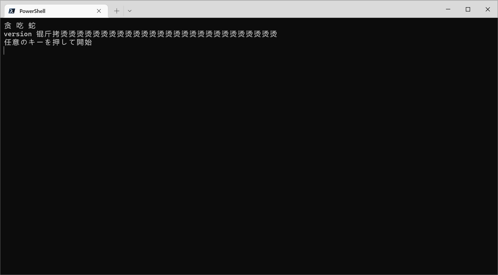
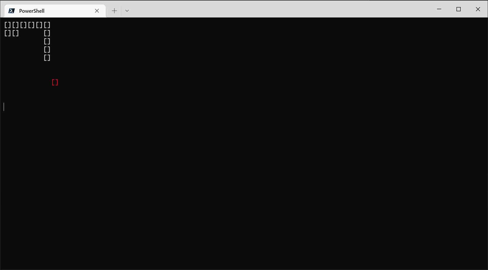
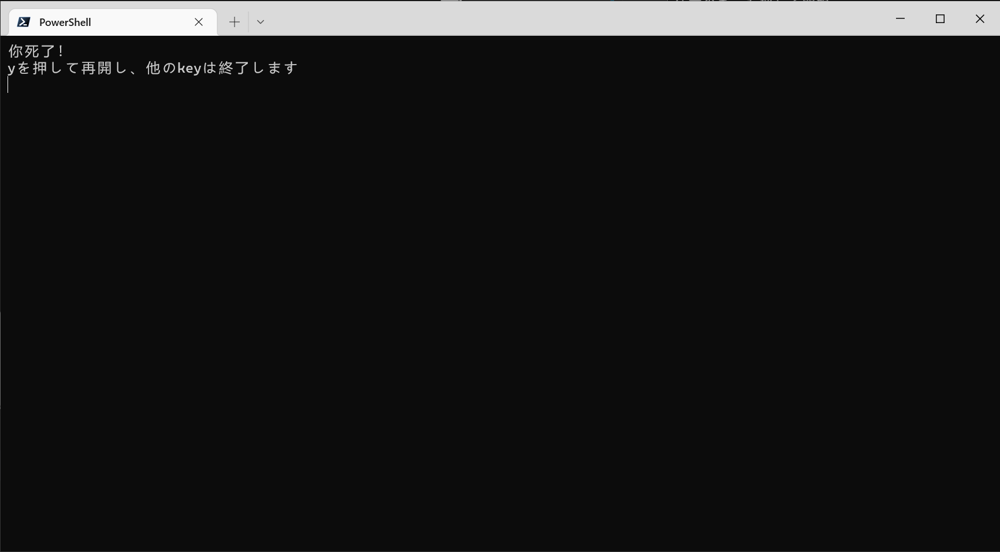

# HungryBug: 《小巧、朴素的休闲游戏》

> 当你的代码能够运行了，你就不要再动它了。

# 简介

你说得对，这是一个贪吃蛇小游戏，它由蛇(python)语言写成，运行在Windows的控制台上（因为用了msvcrt库）。

你要做的就是在遍地Bug、险象环生的游戏世界里，呵护你的小蛇健康成长。

# 一些玩法说明
为了您能够正常游玩该游戏，请遵循以下规则：
1. 开屏界面和死亡界面的提示文字是完全正确的
2. 进入游戏后，一对方括号的大小为一个单元格，小蛇不能超出10×10的方格区域，否则就会死亡
3. W,A,S,D四个键用于移动，不要使用hjkl，不要使用⬆⬇←→按键，因为这是未定义行为(undefined behavior)
4. 蛇头和蛇身的标识是完全一样的，需要自行判断
5. 蛇头碰到食物时，食物会在另一个位置重新生成，同时蛇长+1，但追加的位置非常随便，有时触碰地图边界的食物会导致意外的死亡
6. 存在一定的死局情况，触发条件未知
7. 蛇的身体可能会穿模，或者按未定义的方向移动
8. ...

# 安装
直接在release界面下载即可（目前只支持Windows 64位系统，建议Windows 10以上用户安装Windows Terminal，否则多色显示可能无法工作；部分电脑可能出现中文乱码）

# 截屏

开始界面

游玩中

死亡界面